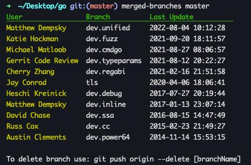

# Merged Branches

## Installation

- Download standalone binary for apple from
  [releases](https://github.com/semiherdogan/merged-branches/releases).
- Move downloaded file to path
- At first run macOS may need permissions to run this app. For allowing this app to run you need to allow it from "Security & Privacy" section
- Or you can download source code and compile on your own.

## Usage

`merged-branches [branch] [user]`

- `--help` to print help.
- `--version` to print app version.
- `[branch]` branch to check (default: `master`)
- `[user]` user to filter (optional)

## License

The MIT License (MIT). Please see [License](LICENSE) file for more information.
